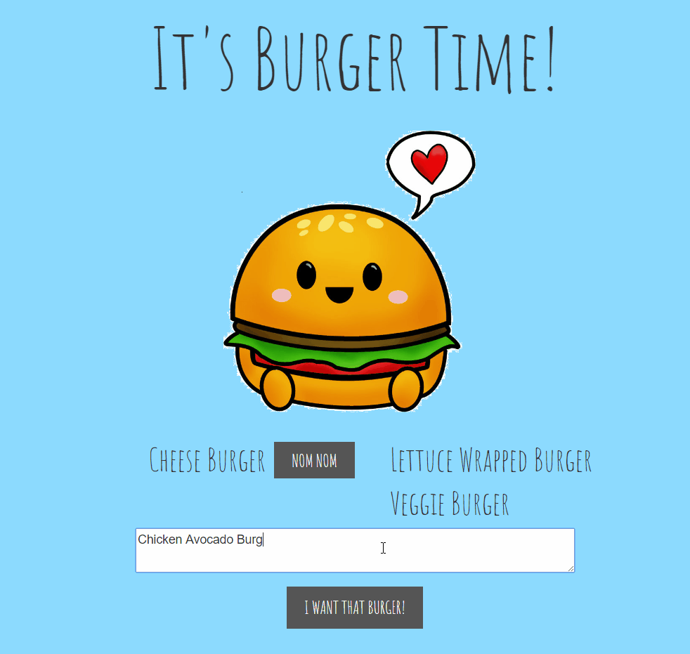

# Burger.js

#### The is a Node Express App that uses MySQL to maintain a database and Handlebars to serve up the HTML page.

### Creating a burger

#### Submitting the text written in the form will be added to the MySQL database and the webpage will be updated in real time.

### Eating a burger

#### Clicking on the button next to the buger, will update the database and move the burger from the left side of the screen to the right side of the screen.

 